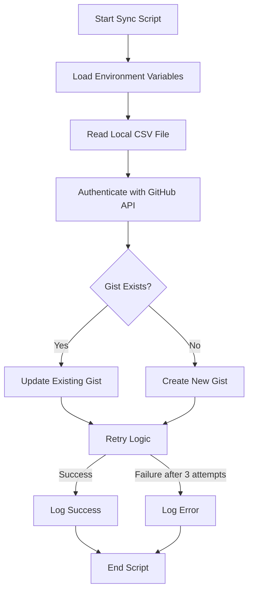

# GitHub Gists Integration Plan

## Overview

We'll create a separate script that syncs the local CSV file to GitHub Gists. The existing application will remain unchanged, and a new npm command will be added to package.json to execute this sync script.

## Architecture



## Implementation Details

### 1. Environment Configuration

1. Add a `.env` file to store the GitHub personal access token
2. Install the `dotenv` package to load environment variables
3. Add the `.env` file to `.gitignore` to prevent it from being tracked

### 2. Sync Script

1. Create a new file `syncToGist.ts` that:
   - Reads the local CSV file
   - Authenticates with GitHub API
   - Creates or updates a Gist with the CSV content
   - Implements retry logic (3 attempts total)
   - Handles errors and logging

### 3. Package.json Updates

1. Add a new script command to package.json:
   ```json
   "scripts": {
     "sync-to-gist": "tsx syncToGist.ts"
   }
   ```

### 4. Configuration

1. Use environment variables for GitHub configuration:
   - `GITHUB_TOKEN`: Personal access token
   - `GIST_ID`: Optional existing Gist ID
   - `GIST_DESCRIPTION`: Description for the Gist
   - `GIST_FILENAME`: Filename for the CSV content in the Gist

## Technical Implementation

### Dependencies to Add

```json
{
  "dependencies": {
    "@octokit/rest": "^19.0.7",
    "dotenv": "^16.0.3"
  }
}
```

### New Files

1. `.env` file:
```
GITHUB_TOKEN=your_personal_access_token
GIST_ID=optional_existing_gist_id
GIST_DESCRIPTION=FlatCrawl URL Database
GIST_FILENAME=urls.csv
```

2. `syncToGist.ts` script:
- Functions for GitHub authentication
- Functions for creating/updating Gists
- Retry logic implementation
- Error handling

### Modified Files

1. `package.json`:
- Add the new script command
- Add new dependencies

## Error Handling Strategy

1. If syncing fails, retry 2 times (total 3 attempts)
2. Log errors to console while retrying
3. If all retries fail, log an error message and exit with a non-zero status code

## Usage

Users can run the sync script manually after running the main application:

```bash
# First run the main application to update the CSV
npm run start

# Then sync the CSV to GitHub Gists
npm run sync-to-gist
```

Or they can create a combined command:

```bash
# Add to package.json
"scripts": {
  "start-and-sync": "npm run start && npm run sync-to-gist"
}
```

## Security Considerations

1. The GitHub token will be stored in a `.env` file not tracked by git
2. The token should have minimal permissions (only Gist create/edit)
3. No sensitive information will be exposed in logs