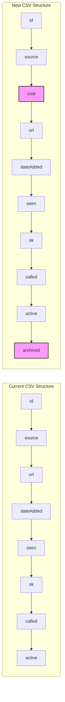
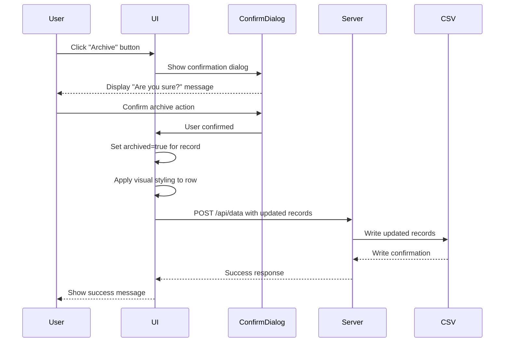
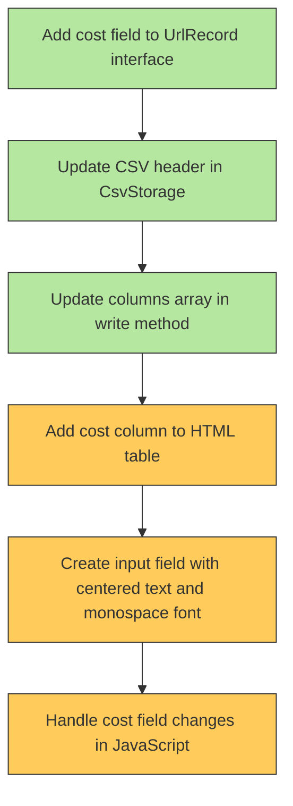
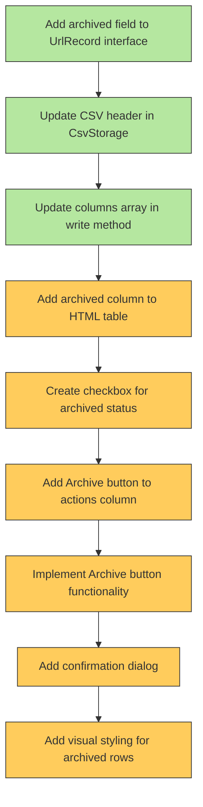
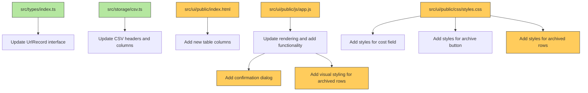

# Archiving and Cost Implementation Diagrams

## CSV Structure Changes



## UI Component Changes

```mermaid
graph TD
    subgraph "Current UI Table"
    A[ID] --> B[Source] --> C[URL] --> D[Date Added] --> E[Seen] --> F[OK] --> G[Called] --> H[Active] --> I[Actions]
    end
    
    subgraph "New UI Table"
    J[ID] --> K[Source] --> L[Cost] --> M[URL] --> N[Date Added] --> O[Seen] --> P[OK] --> Q[Called] --> R[Active] --> S[Archived] --> T[Actions<br>+ Archive Button]
    end
    
    style L fill:#f9f,stroke:#333,stroke-width:2px
    style S fill:#f9f,stroke:#333,stroke-width:2px
    style T fill:#f9f,stroke:#333,stroke-width:2px
```



## Data Flow for Archive Action with Confirmation



## Cost Field Implementation



## Archive Feature Implementation



## File Changes Overview



## Visual Styling for Archived Rows

```mermaid
graph TD
    subgraph "Normal Row"
    A[Regular styling]
    end
    
    subgraph "Archived Row"
    B[Strikethrough text or grayed out appearance]
    end
    
    C[CSS Rule] --> D[.archived-row { opacity: 0.6; text-decoration: line-through; }]
    
    style B fill:#f9f,stroke:#333,stroke-width:2px
    style D fill:#b5e7a0,stroke:#333,stroke-width:1px
```

## Confirmation Dialog Implementation

```mermaid
sequenceDiagram
    participant User
    participant ArchiveButton
    participant ConfirmDialog
    participant DataHandler
    
    User->>ArchiveButton: Click
    ArchiveButton->>ConfirmDialog: Show dialog
    ConfirmDialog-->>User: "Are you sure you want to archive this record?"
    Note over ConfirmDialog: Options: "Cancel" and "Archive"
    
    alt User clicks "Cancel"
        User->>ConfirmDialog: Click "Cancel"
        ConfirmDialog->>ArchiveButton: Cancel operation
    else User clicks "Archive"
        User->>ConfirmDialog: Click "Archive"
        ConfirmDialog->>DataHandler: Proceed with archive
        DataHandler->>DataHandler: Set archived=true
        DataHandler->>DataHandler: Apply visual styling
        DataHandler-->>User: Show success message
    end