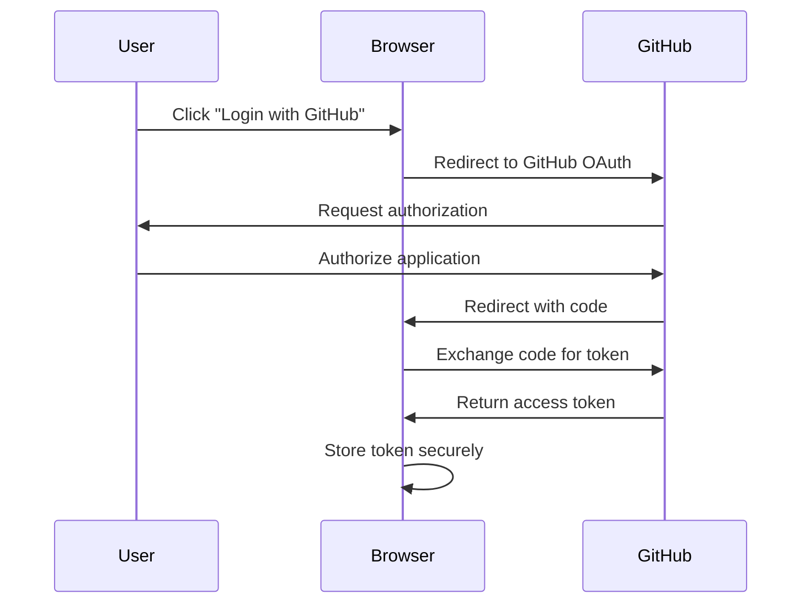

# Frontend GitHub Gist Integration Design

## Problem Statement

Currently, the FlatCrawl application requires a backend server to update GitHub Gists. The user wants to be able to update the CSV file in GitHub Gists directly from the frontend without a backend, with authorization completely on the frontend.

## Current Implementation

The current implementation uses:

1. A backend server (`src/ui/server.ts`) that provides API endpoints for:
   - Getting CSV data (`/api/data` GET)
   - Updating CSV data (`/api/data` POST)
   - Triggering sync to GitHub Gist (`/api/sync` POST)

2. The GitHub Gist integration is implemented in `src/storage/gist.ts` using the Octokit library, which requires a GitHub token for authentication.

3. The token is stored in the `.env` file on the server.

## Proposed Solution

Implement a fully frontend-based GitHub Gist integration that:

1. Uses GitHub OAuth flow to authenticate users directly from the browser
2. Stores the token securely in the browser
3. Uses the GitHub API directly from the frontend to read and update Gists

## Technical Design

### 1. GitHub OAuth Integration

We'll use the GitHub OAuth flow to get a token with the `gist` scope:



### 2. Token Storage

We'll store the token securely in the browser using:

- `localStorage` for persistence across sessions
- Encryption of the token before storing (using a library like CryptoJS)

### 3. GitHub API Integration

We'll use the GitHub REST API directly from the frontend:

- For reading Gists: `GET /gists/{gist_id}`
- For updating Gists: `PATCH /gists/{gist_id}`
- For creating Gists: `POST /gists`

### 4. Implementation Components

#### 4.1 OAuth Login Component

```html
<div class="auth-container">
  <div id="login-section" style="display: none;">
    <h3>GitHub Authentication Required</h3>
    <p>To save changes to GitHub Gist, you need to authorize with GitHub.</p>
    <button id="githubLoginBtn" class="btn btn-primary">Login with GitHub</button>
  </div>
  <div id="logged-in-section" style="display: none;">
    <p>Logged in as: <span id="username"></span></p>
    <button id="logoutBtn" class="btn btn-outline-secondary">Logout</button>
  </div>
</div>
```

#### 4.2 GitHub OAuth Client

```javascript
class GitHubOAuthClient {
  constructor(clientId, redirectUri) {
    this.clientId = clientId;
    this.redirectUri = redirectUri;
    this.tokenKey = 'github_token';
    this.userKey = 'github_user';
  }

  // Initiate OAuth flow
  login() {
    const authUrl = `https://github.com/login/oauth/authorize?client_id=${this.clientId}&redirect_uri=${encodeURIComponent(this.redirectUri)}&scope=gist`;
    window.location.href = authUrl;
  }

  // Handle OAuth callback
  async handleCallback(code) {
    // This requires a proxy server to exchange the code for a token
    // because the GitHub OAuth flow requires a client_secret which should not be exposed in frontend code
    const tokenUrl = `https://your-proxy-server.com/exchange-code?code=${code}`;
    const response = await fetch(tokenUrl);
    const data = await response.json();
    
    if (data.access_token) {
      this.saveToken(data.access_token);
      await this.fetchUserInfo();
      return true;
    }
    return false;
  }

  // Save token to localStorage (with encryption in a real implementation)
  saveToken(token) {
    localStorage.setItem(this.tokenKey, token);
  }

  // Get token from localStorage
  getToken() {
    return localStorage.getItem(this.tokenKey);
  }

  // Check if user is logged in
  isLoggedIn() {
    return !!this.getToken();
  }

  // Fetch user info
  async fetchUserInfo() {
    const token = this.getToken();
    if (!token) return null;
    
    const response = await fetch('https://api.github.com/user', {
      headers: {
        'Authorization': `token ${token}`
      }
    });
    
    if (response.ok) {
      const user = await response.json();
      localStorage.setItem(this.userKey, JSON.stringify(user));
      return user;
    }
    
    return null;
  }

  // Get user info from localStorage
  getUserInfo() {
    const userJson = localStorage.getItem(this.userKey);
    return userJson ? JSON.parse(userJson) : null;
  }

  // Logout
  logout() {
    localStorage.removeItem(this.tokenKey);
    localStorage.removeItem(this.userKey);
  }
}
```

#### 4.3 GitHub Gist Client

```javascript
class GitHubGistClient {
  constructor(oauthClient) {
    this.oauthClient = oauthClient;
    this.baseUrl = 'https://api.github.com';
  }

  // Get headers with authorization
  getHeaders() {
    const token = this.oauthClient.getToken();
    return {
      'Authorization': `token ${token}`,
      'Accept': 'application/vnd.github.v3+json',
      'Content-Type': 'application/json'
    };
  }

  // Get a Gist
  async getGist(gistId) {
    const response = await fetch(`${this.baseUrl}/gists/${gistId}`, {
      headers: this.getHeaders()
    });
    
    if (!response.ok) {
      throw new Error(`Failed to fetch Gist: ${response.statusText}`);
    }
    
    return await response.json();
  }

  // Update a Gist
  async updateGist(gistId, filename, content) {
    const files = {};
    files[filename] = { content };
    
    const response = await fetch(`${this.baseUrl}/gists/${gistId}`, {
      method: 'PATCH',
      headers: this.getHeaders(),
      body: JSON.stringify({ files })
    });
    
    if (!response.ok) {
      throw new Error(`Failed to update Gist: ${response.statusText}`);
    }
    
    return await response.json();
  }

  // Create a new Gist
  async createGist(filename, content, description, isPublic = false) {
    const files = {};
    files[filename] = { content };
    
    const response = await fetch(`${this.baseUrl}/gists`, {
      method: 'POST',
      headers: this.getHeaders(),
      body: JSON.stringify({
        description,
        public: isPublic,
        files
      })
    });
    
    if (!response.ok) {
      throw new Error(`Failed to create Gist: ${response.statusText}`);
    }
    
    return await response.json();
  }
}
```

#### 4.4 Integration with Existing UI

```javascript
// Initialize OAuth client
const oauthClient = new GitHubOAuthClient(
  'your-github-client-id',
  'https://your-app-url.com/callback'
);

// Initialize Gist client
const gistClient = new GitHubGistClient(oauthClient);

// DOM elements
const loginSection = document.getElementById('login-section');
const loggedInSection = document.getElementById('logged-in-section');
const usernameSpan = document.getElementById('username');
const githubLoginBtn = document.getElementById('githubLoginBtn');
const logoutBtn = document.getElementById('logoutBtn');

// Check login status on page load
function checkLoginStatus() {
  if (oauthClient.isLoggedIn()) {
    const user = oauthClient.getUserInfo();
    if (user) {
      loginSection.style.display = 'none';
      loggedInSection.style.display = 'block';
      usernameSpan.textContent = user.login;
    } else {
      loginSection.style.display = 'block';
      loggedInSection.style.display = 'none';
    }
  } else {
    loginSection.style.display = 'block';
    loggedInSection.style.display = 'none';
  }
}

// Handle OAuth callback
function handleOAuthCallback() {
  const urlParams = new URLSearchParams(window.location.search);
  const code = urlParams.get('code');
  
  if (code) {
    oauthClient.handleCallback(code)
      .then(success => {
        if (success) {
          // Remove code from URL
          window.history.replaceState({}, document.title, window.location.pathname);
          checkLoginStatus();
          fetchData(); // Reload data after login
        }
      });
  }
}

// Modify fetchData function to use Gist client
async function fetchData() {
  try {
    setLoading(true);
    
    // Check if logged in
    if (!oauthClient.isLoggedIn()) {
      checkLoginStatus();
      setLoading(false);
      return;
    }
    
    const gistId = 'your-gist-id'; // This could be stored in localStorage or as a URL parameter
    const gist = await gistClient.getGist(gistId);
    
    // Get CSV content from the Gist
    const filename = 'urls.csv'; // This could be configurable
    const csvString = gist.files[filename].content;
    
    csvData = parseCSV(csvString);
    renderTable();
    showStatus('Data loaded successfully from GitHub Gist');
  } catch (error) {
    console.error('Error fetching data:', error);
    showStatus('Error loading data: ' + error.message, true);
  } finally {
    setLoading(false);
  }
}

// Modify syncToGist function to use Gist client
async function syncToGist() {
  try {
    setLoading(true);
    
    // Check if logged in
    if (!oauthClient.isLoggedIn()) {
      showStatus('Please login with GitHub first', true);
      checkLoginStatus();
      setLoading(false);
      return;
    }
    
    if (!hasChanges) {
      showStatus('No changes to save');
      setLoading(false);
      return;
    }
    
    const csvString = convertToCSV(csvData);
    const gistId = 'your-gist-id'; // This could be stored in localStorage or as a URL parameter
    const filename = 'urls.csv'; // This could be configurable
    
    await gistClient.updateGist(gistId, filename, csvString);
    
    showStatus('Successfully synced to GitHub Gist');
    hasChanges = false;
    
    // Reload data after syncing
    setTimeout(fetchData, 2000);
  } catch (error) {
    console.error('Error syncing to Gist:', error);
    showStatus('Error syncing to Gist: ' + error.message, true);
  } finally {
    setLoading(false);
  }
}

// Event listeners
githubLoginBtn.addEventListener('click', () => oauthClient.login());
logoutBtn.addEventListener('click', () => {
  oauthClient.logout();
  checkLoginStatus();
});

// Initialize
document.addEventListener('DOMContentLoaded', () => {
  handleOAuthCallback();
  checkLoginStatus();
  if (oauthClient.isLoggedIn()) {
    fetchData();
  }
});
```

## OAuth Proxy Server

Since the GitHub OAuth flow requires a client secret which should not be exposed in frontend code, we need a small proxy server to exchange the code for a token. This can be a simple serverless function or a minimal Express server:

```javascript
// Example using Express
const express = require('express');
const axios = require('axios');
const cors = require('cors');
require('dotenv').config();

const app = express();
app.use(cors());

app.get('/exchange-code', async (req, res) => {
  const { code } = req.query;
  
  if (!code) {
    return res.status(400).json({ error: 'Code is required' });
  }
  
  try {
    const response = await axios.post('https://github.com/login/oauth/access_token', {
      client_id: process.env.GITHUB_CLIENT_ID,
      client_secret: process.env.GITHUB_CLIENT_SECRET,
      code
    }, {
      headers: {
        Accept: 'application/json'
      }
    });
    
    res.json(response.data);
  } catch (error) {
    console.error('Error exchanging code for token:', error);
    res.status(500).json({ error: 'Failed to exchange code for token' });
  }
});

const PORT = process.env.PORT || 3000;
app.listen(PORT, () => {
  console.log(`OAuth proxy server running on port ${PORT}`);
});
```

## Alternative Approaches

### 1. GitHub Pages + GitHub Actions

If the goal is to completely eliminate the need for a backend server, another approach is to use GitHub Pages to host the frontend and GitHub Actions to update the Gist:

1. Host the viewer on GitHub Pages
2. When changes are made, commit them to a repository using the GitHub API
3. Set up a GitHub Action that triggers on commits and updates the Gist

### 2. Use GitHub's Device Flow

For a better user experience, we could use GitHub's device flow for authentication, which doesn't require a redirect:

```javascript
// Request device and user codes
async function requestDeviceAndUserCodes() {
  const response = await fetch('https://github.com/login/device/code', {
    method: 'POST',
    headers: {
      'Accept': 'application/json',
      'Content-Type': 'application/json'
    },
    body: JSON.stringify({
      client_id: 'your-github-client-id',
      scope: 'gist'
    })
  });
  
  return await response.json();
}

// Poll for access token
async function pollForAccessToken(deviceCode, interval) {
  const response = await fetch('https://github.com/login/oauth/access_token', {
    method: 'POST',
    headers: {
      'Accept': 'application/json',
      'Content-Type': 'application/json'
    },
    body: JSON.stringify({
      client_id: 'your-github-client-id',
      device_code: deviceCode,
      grant_type: 'urn:ietf:params:oauth:grant-type:device_code'
    })
  });
  
  return await response.json();
}
```

## Security Considerations

1. **Token Storage**: Storing tokens in localStorage is convenient but not completely secure. Consider using more secure alternatives like:
   - HttpOnly cookies (requires a backend)
   - Web Crypto API for encryption
   - Session storage for shorter-lived tokens

2. **Scope Limitation**: Request only the `gist` scope, not full repo access

3. **Token Expiration**: Implement token refresh logic if using expiring tokens

4. **CORS**: Ensure proper CORS configuration for the OAuth proxy server

5. **CSP**: Implement a Content Security Policy to prevent XSS attacks

## Implementation Plan

1. **Phase 1: Setup GitHub OAuth Application**
   - Register a new OAuth application on GitHub
   - Configure the callback URL
   - Set up the minimal OAuth proxy server

2. **Phase 2: Implement Frontend Authentication**
   - Create the OAuth client class
   - Implement the login/logout functionality
   - Add UI components for authentication

3. **Phase 3: Implement Gist Integration**
   - Create the Gist client class
   - Modify the existing data fetching and syncing functions
   - Test with a sample Gist

4. **Phase 4: Enhance Security and UX**
   - Improve token storage security
   - Add error handling and retry logic
   - Enhance the user interface

5. **Phase 5: Testing and Deployment**
   - Test on different browsers and devices
   - Deploy the OAuth proxy server
   - Update documentation