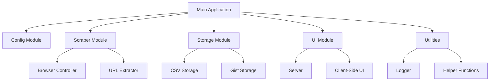

# Product Context

## Product Overview

FlatCrawl is a web scraping application designed to automate the process of extracting links from websites. It provides a configurable way to scrape links from various sources, store them with metadata, and manage them through a web interface.

## Architecture

The refactored architecture follows a modular design with clear separation of concerns:



## Core Components

### 1. Configuration Module

The Configuration Module is responsible for loading, validating, and providing access to application settings.

**Key Files:**
- `src/config/index.ts`: Main configuration management
- `src/config/schema.ts`: Configuration validation schemas

**Key Interfaces:**
```typescript
interface SourceConfig {
  url: string;
  command: string;
}

interface DataConfig {
  [key: string]: SourceConfig;
}

interface GistConfig {
  token: string;
  gistId?: string;
  description: string;
  filename: string;
}
```

### 2. Scraper Module

The Scraper Module handles browser automation and URL extraction.

**Key Files:**
- `src/scraper/index.ts`: Main scraper module
- `src/scraper/browser.ts`: Browser controller
- `src/scraper/extractor.ts`: URL extraction logic

**Key Classes:**
- `BrowserController`: Manages browser automation
- `UrlExtractor`: Handles URL extraction and processing
- `Scraper`: Coordinates the scraping process

### 3. Storage Module

The Storage Module manages data persistence across different storage mechanisms.

**Key Files:**
- `src/storage/index.ts`: Storage module entry point
- `src/storage/csv.ts`: CSV storage implementation
- `src/storage/gist.ts`: GitHub Gist storage implementation

**Key Classes:**
- `CsvStorage`: Manages CSV file operations
- `GistStorage`: Manages GitHub Gist operations

### 4. UI Module

The UI Module provides a web interface for viewing and managing scraped data.

**Key Files:**
- `src/ui/index.ts`: UI module entry point
- `src/ui/server.ts`: API server
- `src/ui/public/`: Static assets

**Key Components:**
- Express server for API endpoints
- HTML/CSS/JS for client-side interface

### 5. Utilities

The Utilities module provides common functionality used across the application.

**Key Files:**
- `src/utils/logger.ts`: Logging utility
- `src/utils/helpers.ts`: Helper functions

**Key Components:**
- `Logger`: Flexible logging system
- Helper functions for common tasks

## Data Model

The core data model revolves around URL records:

```typescript
interface UrlRecord {
  id: string;
  source: string;
  url: string;
  dateAdded: string;
  seen: boolean;
  ok: boolean;
  called: boolean;
  active: boolean;
}
```

## External Dependencies

1. **Puppeteer**: Used for browser automation
2. **Octokit**: Used for GitHub API integration
3. **Dotenv**: Used for loading environment variables
4. **TypeScript**: Used for type-safe JavaScript

## Configuration

The application is configured through:

1. `config.json`: Contains source configurations
2. `.env`: Contains environment variables for GitHub integration

## User Interfaces

1. **Command Line Interface**: For running scraping operations
2. **Web Interface**: For viewing and managing scraped data

## Integration Points

1. **GitHub Gists**: For syncing and backing up data
2. **Web Browsers**: For scraping operations

## Performance Considerations

1. **Browser Automation**: Puppeteer operations can be resource-intensive
2. **CSV File Operations**: Large CSV files may impact performance
3. **GitHub API Rate Limits**: May affect Gist operations

## Security Considerations

1. **GitHub Token**: Stored in .env file, needs to be kept secure
2. **Browser Automation**: Needs to be run in a controlled environment
3. **User Input**: Should be validated to prevent injection attacks