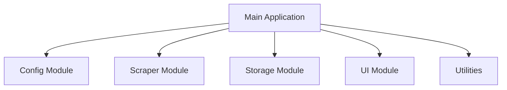
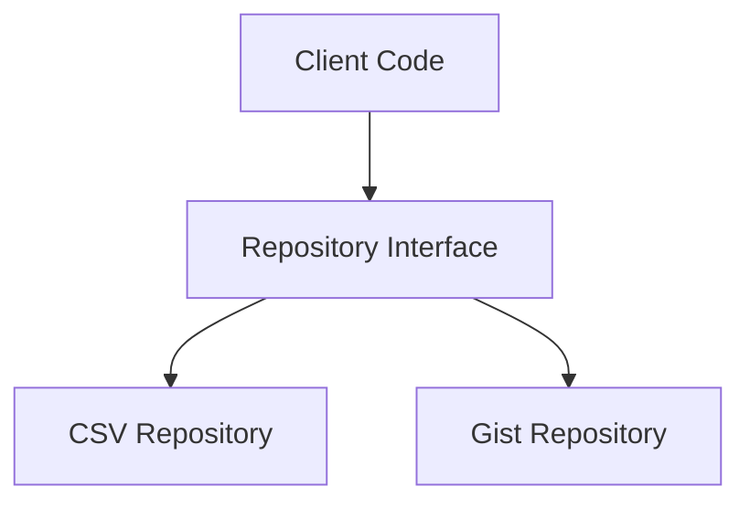

# System Patterns

This document outlines the key architectural patterns, coding standards, and best practices for the FlatCrawl project.

## Architectural Patterns

### 1. Modular Architecture

FlatCrawl follows a modular architecture with clear separation of concerns:

**Key Principles:**
- Each module has a well-defined responsibility
- Modules communicate through clear interfaces
- Dependencies between modules are explicit and minimized
- Modules can be tested independently

**Implementation:**
- Each module is contained in its own directory
- Each module has an index.ts file that exports its public API
- Internal implementation details are hidden from other modules

### 2. Repository Pattern

The Storage module implements the Repository pattern to abstract data access:

**Key Principles:**
- Data access logic is encapsulated in repository classes
- Clients interact with repositories through interfaces
- Implementation details of data storage are hidden
- Repositories provide CRUD operations on data entities

**Implementation:**
- Storage interfaces define common operations
- Concrete implementations handle specific storage mechanisms
- Repositories return domain objects, not storage-specific structures

### 3. Factory Pattern

The application uses factory functions/methods to create complex objects:

**Key Principles:**
- Object creation logic is centralized
- Clients are decoupled from object creation details
- Configuration can influence object creation

**Implementation:**
- Factory functions create and configure objects
- Dependencies are injected into created objects
- Configuration parameters control object behavior

### 4. Dependency Injection

The application uses constructor injection for dependencies:

**Key Principles:**
- Dependencies are explicitly declared in constructors
- Objects don't create their dependencies
- Dependencies can be mocked for testing

**Implementation:**
- Class constructors accept dependencies as parameters
- Default implementations can be provided for convenience
- Test code can provide mock implementations

## Coding Standards

### TypeScript Best Practices

1. **Type Definitions:**
   - Prefer interfaces for object types
   - Use type aliases for union types and complex types
   - Export all public types from module index files
   - Use descriptive type names

2. **Null/Undefined Handling:**
   - Use undefined (not null) for missing values
   - Use optional parameters and properties (?) for potentially missing values
   - Use non-null assertion (!) only when you're certain a value exists
   - Use nullish coalescing (??) for default values

3. **Async Code:**
   - Use async/await instead of raw promises
   - Handle errors with try/catch
   - Avoid mixing callbacks and promises
   - Return promises consistently

4. **Error Handling:**
   - Use custom error classes for domain-specific errors
   - Include context information in error messages
   - Log errors with appropriate severity
   - Provide meaningful stack traces

### Code Organization

1. **File Structure:**
   - One class/interface per file (with exceptions for related small interfaces)
   - Group related files in directories
   - Use index.ts files to export public API
   - Keep files focused on a single responsibility

2. **Naming Conventions:**
   - PascalCase for classes, interfaces, and types
   - camelCase for variables, functions, and methods
   - UPPER_CASE for constants
   - Use descriptive, intention-revealing names

3. **Comments and Documentation:**
   - Use JSDoc comments for public APIs
   - Document parameters, return values, and exceptions
   - Explain "why" not "what" in comments
   - Keep comments up-to-date with code changes

## Error Handling Strategy

1. **Error Types:**
   - `ConfigurationError`: For configuration-related errors
   - `ScraperError`: For browser and scraping errors
   - `StorageError`: For data storage errors
   - `ApplicationError`: Base class for application-specific errors

2. **Error Propagation:**
   - Low-level modules throw specific errors
   - Higher-level modules catch, log, and optionally re-throw
   - Main application handles uncaught errors

3. **Error Recovery:**
   - Implement retry logic for transient failures
   - Provide fallback mechanisms where appropriate
   - Ensure clean resource cleanup on errors

4. **Error Logging:**
   - Log all errors with context information
   - Use appropriate log levels based on severity
   - Include stack traces for debugging

## Testing Strategy

1. **Unit Testing:**
   - Test each module in isolation
   - Mock dependencies using interfaces
   - Focus on behavior, not implementation details
   - Aim for high code coverage

2. **Integration Testing:**
   - Test interactions between modules
   - Use real implementations for some dependencies
   - Test configuration variations
   - Test error handling and edge cases

3. **End-to-End Testing:**
   - Test complete workflows
   - Verify data persistence
   - Test UI interactions
   - Simulate real-world scenarios

## Performance Considerations

1. **Browser Automation:**
   - Reuse browser instances when possible
   - Implement timeouts for all operations
   - Limit concurrent browser instances
   - Consider headless mode for production

2. **Data Storage:**
   - Implement efficient CSV parsing/writing
   - Cache data in memory when appropriate
   - Implement pagination for large datasets
   - Use streaming for large file operations

3. **API Interactions:**
   - Implement rate limiting for GitHub API
   - Cache API responses when appropriate
   - Use conditional requests (If-Modified-Since)
   - Implement exponential backoff for retries

## Security Considerations

1. **Credentials Management:**
   - Store sensitive data in environment variables
   - Never commit credentials to version control
   - Implement proper error messages that don't leak sensitive information
   - Validate all configuration values

2. **Input Validation:**
   - Validate all user inputs
   - Sanitize data before storage
   - Implement proper error messages for invalid inputs
   - Use parameterized commands for browser automation

3. **Output Handling:**
   - Sanitize data before display
   - Implement proper error messages for display
   - Validate data loaded from storage before use