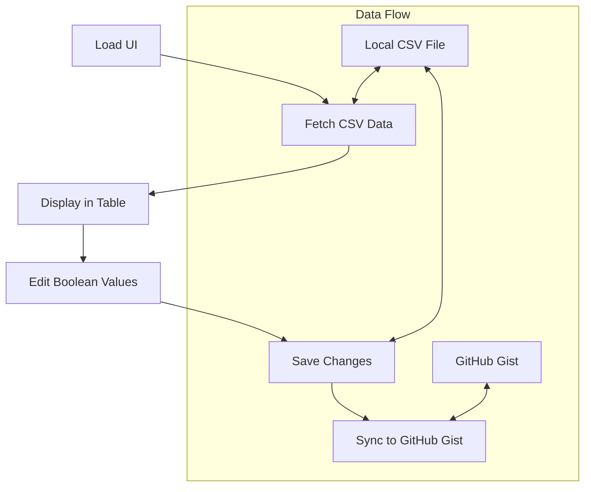

# UI Viewer for GitHub Gist Data

## Overview

We'll create a simple UI viewer for the GitHub Gist data that will:

1. Display the CSV data in a table format
2. Allow editing of boolean values (seen, ok, called, active)
3. Save changes to the local file
4. Provide a button to sync with GitHub Gist

## Architecture



## Implementation Details

### 1. HTML Structure

Create a new file `viewer.html` with:
- A table to display the CSV data
- Toggle switches for boolean values
- Save button
- Sync button
- Status messages area

### 2. JavaScript Functionality

1. **Data Loading**:
   - Read the local CSV file
   - Parse CSV into JSON
   - Populate the table

2. **Editing**:
   - Add toggle switches for boolean columns
   - Track changes made by the user

3. **Saving**:
   - Write changes back to the local CSV file
   - Show success/error messages

4. **Syncing**:
   - Execute the `pnpm run sync-to-gist` command
   - Show sync status

### 3. Server Component

We'll need a small server component to:
- Serve the HTML file
- Handle file read/write operations
- Execute the sync command

Options:
1. Create a simple Express.js server
2. Use Node.js built-in http module
3. Extend the existing application

### 4. API Endpoints

1. `GET /api/data` - Get CSV data
2. `POST /api/data` - Update CSV data
3. `POST /api/sync` - Trigger sync to GitHub Gist

## Technical Implementation

### Files to Create

1. `viewer.html` - The main UI
2. `server.js` - Simple server to handle API requests
3. `public/styles.css` - CSS for the UI
4. `public/script.js` - Client-side JavaScript

### Dependencies

- Express.js for the server
- CSV Parser for handling CSV data
- Child Process for executing the sync command

### Package.json Updates

Add a new script command:
```json
"scripts": {
  "viewer": "node server.js"
}
```

## UI Design

The UI will be a simple, responsive table with:

1. **Header Row**:
   - ID
   - Source
   - URL
   - Date Added
   - Seen (toggle)
   - OK (toggle)
   - Called (toggle)
   - Active (toggle)
   - Actions

2. **Data Rows**:
   - Display all CSV data
   - Toggle switches for boolean values
   - Link to open URL

3. **Control Panel**:
   - Save Changes button
   - Sync to Gist button
   - Status messages

## Security Considerations

1. The server will only run locally
2. No sensitive data will be exposed in the UI
3. The GitHub token will remain in the .env file

## Usage Instructions

1. Start the viewer:
   ```bash
   pnpm run viewer
   ```

2. Open in browser:
   ```
   http://localhost:3000
   ```

3. View and edit data
4. Save changes
5. Sync to GitHub Gist